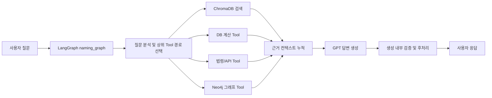
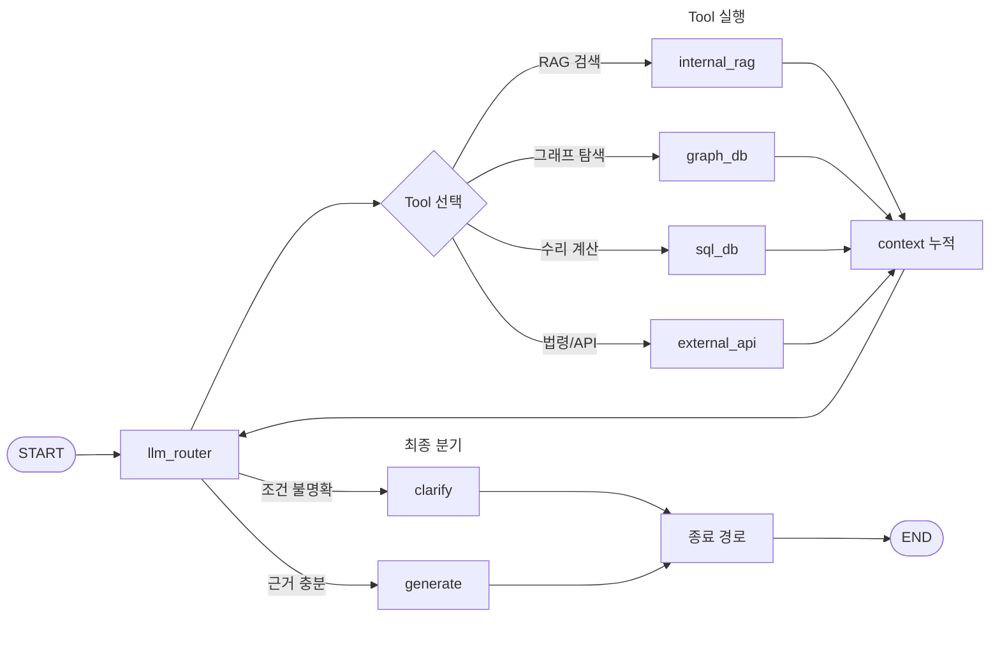

# 조건 기반 맞춤 작명 QA 시스템

| 항목 | 내용 |
|---|---|
| 과정명 | SKN29기 4팀 - 3차 단위 프로젝트 |
| 정리일 | 2026-06-18 |
| 프로젝트 성격 | 내외부 문서 기반 조건형 작명 QA 시스템 |
| 핵심 스택 | LangGraph, ChromaDB, Neo4j, FastMCP Tool, OpenAI API, Qwen3.5-4B LoRA 실험 |
| 운영 판단 | GPT 기반 RAG + Tool Pipeline을 운영 기준으로 사용하고, Qwen 파인튜닝은 비교 실험 및 향후 Hybrid 후보로 분리 |

---

## 1. 문서 범위

본 문서는 조건 기반 맞춤 작명 QA 시스템의 데이터 구축, 운영 Pipeline, Tool 구성, 평가 결과를 하나의 흐름으로 정리한 최종 결과 보고서이다.

내용은 현재 프로젝트 저장소에 남아 있는 원천 데이터, 정제 산출물, 구현 코드, 테스트 결과를 기준으로 작성했다. 아직 운영에 반영하지 않은 확장 후보군이나 후속 개선 항목은 현재 구현 결과와 구분해 별도로 표시한다.

### 1.1 핵심 산출물 추적표

| 구분 | 산출물 | 확인 내용 |
|---|---|---|
| 원천 데이터 | [data/raw](../../data/raw) | PDF, XLS, JSON, Unihan 원천 자료 |
| 정제 데이터 | [data/processed](../../data/processed) | ChromaDB와 Neo4j 입력으로 사용한 JSON 산출물 |
| 운영 ChromaDB | [data/chroma](../../data/chroma) | 6개 운영 컬렉션 저장소 |
| LangGraph Pipeline | [naming_graph.py](../../src/graph/naming_graph.py) | Router, Tool 실행, 답변 생성, 후처리 흐름 |
| Tool 모듈 | [src/mcp](../../src/mcp) | RAG, DB 계산, 법령/API, 그래프 Tool |
| Neo4j 인덱싱 | [index_hanja_neo4j.py](../../src/graph/index_hanja_neo4j.py) | 한자, 오행, 법령 허용 관계 그래프 적재 |
| Pipeline 검증 | [rag_eval.py](../../tests/rag_eval.py) | GPT Pipeline 검증 실행 코드 |
| Pipeline 검증 결과 | [rag_eval_result.json](../../data/processed/rag_eval_result.json) | 11개 케이스 검증 결과 |
| Qwen 실험 | [finetuning](../../finetuning) | LoRA/QLoRA 실험 코드 및 결과 |
| Qwen 검증 결과 | [qwen_eval_result.json](../../data/processed/qwen_eval_result.json) | Qwen 단독 응답 검증 결과 |

---

## 2. 프로젝트 개요

본 프로젝트는 사용자의 작명 조건을 입력받아 한자, 수리, 오행, 법령, 순우리말 이름, 논문 기반 정보를 함께 검토하고 이름 후보를 추천하는 조건 기반 맞춤 작명 QA 시스템이다.

단순히 LLM이 이름을 생성하는 방식이 아니라, 정제된 문서 데이터, 벡터 검색, 그래프 관계 탐색, 수리 계산 Tool, 법령/API Tool을 결합한 Pipeline 기반 QA 구조로 설계했다.

| 항목 | 내용 |
|---|---|
| 프로젝트명 | 조건 기반 맞춤 작명 QA 시스템 |
| 핵심 목적 | 사용자의 조건에 맞는 이름 후보를 근거 기반으로 추천 |
| 운영 기본 모델 | `gpt-5.4-mini` |
| 운영 구조 | LangGraph ReAct Pipeline + ChromaDB + Neo4j + Tool |
| 실험 트랙 | Qwen3.5-4B LoRA 파인튜닝 |
| 최종 판단 | 운영 안정성은 GPT Pipeline이 우세, Qwen은 실험 및 향후 Hybrid 후보 |

---

## 3. 문제 정의와 설계 원칙

작명 도메인은 단순 문장 생성보다 검증 가능한 근거와 조건 충족이 중요하다. 이름 추천 과정에서는 다음 조건들이 함께 고려되어야 한다.

- 성씨와 이름의 한자 획수
- 81수리 길흉
- 발음오행과 자원오행
- 인명용 한자 여부
- 법령상 사용 가능성 검토
- 순우리말 이름 후보
- 논문 기반 이름 트렌드 및 음절 특성
- 사용자가 입력한 성별, 선호 음, 의미 조건

따라서 시스템은 LLM 단독 생성 방식이 아니라 다음 원칙으로 구성했다.

| 설계 원칙 | 설명 |
|---|---|
| 근거 기반 응답 | 정제 데이터, ChromaDB, Neo4j, Tool 호출 결과를 응답 근거로 사용 |
| 계산 분리 | 획수, 수리, 오행 조합 등 규칙 기반 판단은 별도 Tool에서 처리 |
| 검색 분리 | 한자, 법령, 논문, 순우리말 데이터는 ChromaDB 검색으로 처리 |
| 관계 탐색 분리 | 한자, 오행, 인명용 허용 관계는 Neo4j 그래프에서 탐색 |
| 생성 통제 | LLM은 직접 지식을 꾸며내는 역할이 아니라 검색 및 계산 결과를 종합하는 역할 |

---

## 4. 데이터 수집 및 전처리 결과

### 4.1 원천 데이터

프로젝트에서 사용한 원천 데이터는 `data/raw/` 하위에 보관되어 있다.

| 원천 | 파일 예시 | 사용 목적 |
|---|---|---|
| 인명용 한자 PDF | `data/raw/pdf/hanja.pdf` | 인명용 한자 후보 추출 및 정제 |
| 한글 유니코드 PDF | `data/raw/pdf/한글 글자 유니코드.pdf` | 한글 음과 유니코드 매핑 검토 |
| Unihan 데이터 | `data/raw/unihan/*.txt` | 한자 유니코드, 음, 부수/획수 보조 검토 |
| 오행 구분표 | `data/raw/ohaeng/자원오행 발음오행구분표.xlsx` | 발음오행, 자원오행 매핑 |
| 81수리 기준 | `data/raw/reference/81suri.json` | 수리 길흉 데이터 구축 |
| 법령 PDF | 가족관계등록법 및 규칙 PDF | 법령 조문 데이터 구축 |
| 순우리말 PDF/API | 정겨운우리말 PDF, 우리말샘 API | 순우리말 이름 후보 및 검증 |
| 작명 관련 논문 PDF | 이름 트렌드, 성별 음절 특성 논문 | 작명 트렌드 RAG 문서 구축 |
| 출생신고 이름 통계 | `2016_2026상위_출생신고_이름_현황.xls` | 이름 빈도 및 통계 참고 |

### 4.2 정제 데이터 산출물

정제된 데이터는 `data/processed/` 하위 JSON 문서로 저장되어 있다.

| 파일 | 건수 | 용도 |
|---|---:|---|
| `hanja_documents.json` | 2,420 | 운영 기준 인명용 한자 메인 데이터 |
| `hanja2_candidate_documents.json` | 6,564 | 원본 한자 PDF에서 메인 데이터에 포함되지 않은 확장 후보군 |
| `surname_ohaeng.json` | 258 | 성씨 한자의 한글 음과 자원오행 보조 데이터 |
| `ohaeng_documents.json` | 125 | 오행 조합 및 관계 데이터 |
| `suri_documents.json` | 81 | 81수리 길흉 데이터 |
| `law_articles.json` | 250 | 이름 관련 법령 조문 데이터 |
| `urimalsam_names.json` | 301 | 순우리말 이름 후보 데이터 |
| `paper_documents.json` | 264 | 작명 관련 논문 기반 문서 |
| `finetune_data.json` | 311 | Qwen 파인튜닝 실험용 데이터 |

### 4.3 한자 데이터 정제 기준

한자 데이터는 `hanja.pdf` 원본에서 구조화한 전체 인명용 한자 후보를 기준으로 정제했다. 프로젝트 산출물 기준 전체 후보는 문서 레코드 기준 8,984건이며, 이 중 운영 필수 필드가 정제된 2,420건만 메인 데이터로 확정했다.

| 구분 | 설명 | 운영 반영 |
|---|---|---|
| 전체 인명용 한자 후보 | `hanja.pdf` 원본에서 구조화한 한자 후보 8,984건 | 정제 기준 모집단 |
| 메인 한자 데이터 | 전체 후보 중 의미, 음, 유니코드, 획수, 발음오행, 자원오행이 운영 기준에 맞게 정제된 2,420건 | 운영 기본 데이터 |
| 확장 후보군 | 전체 후보 중 메인 운영 기준으로 바로 사용하지 않고 별도 보관한 6,564건 | 운영 보류 및 비교 검증 후보 |

즉 처음부터 2,420건만 대상으로 삼은 것이 아니라, 전체 후보 8,984건을 검토한 뒤 작명 추천에 필요한 의미, 음, 유니코드, 획수, 발음오행, 자원오행 정합성이 확보된 2,420건을 운영 기본 데이터로 선별한 것이다. 나머지 6,564건은 삭제한 데이터가 아니라, [한자 운영 후보군 검증 문서](../../docs/데이터파이프라인/한자/한자_데이터_정제_및_운영후보군_검증_통합정리.md)의 A/B/C ChromaDB 비교 결과에 따라 자동 추천 기본 DB에는 바로 통합하지 않고 확장 후보군 계층으로 분리해 관리한다.

### 4.4 전처리 기술과 품질 관리

본 프로젝트의 전처리는 일반 한국어 문단 코퍼스의 형태소 분석보다, 작명 도메인에 필요한 구조화 필드를 안정적으로 추출하고 검증하는 데 초점을 두었다.

| 전처리 항목 | 실제 적용 내용 |
|---|---|
| PDF 파싱 | 한자, 법령, 논문 PDF에서 텍스트를 추출하고 JSON 문서 구조로 변환 |
| 정규표현식 기반 추출 | 한자, 음, 뜻, 획수, 오행, 법령 조문 번호 등 구조화 필드 추출 |
| 스키마 정규화 | 대부분의 RAG 문서를 `id`, `document`, `metadata` 구조로 통일 |
| 중복 처리 | `law_articles.json` 원천 250건 중 운영 ChromaDB에는 중복 ID 2건 제외 후 248건 적재 |
| 결측/미검증 처리 | 한자 확장 후보군은 운영 메인 데이터와 분리하여 후보군으로 보관 |
| 한자 데이터 검증 | 원본 PDF, Unihan, 오행표, 유니코드 자료를 교차 참고 |
| 논문 청킹 | 논문 본문과 통계표 성격을 구분해 RAG 검색 가능한 문서 단위로 정리 |

KoNLPy 기반 형태소 분석과 불용어 처리는 일반 한국어 텍스트 전처리에서 유효하지만, 한자 1자 단위 사전형 데이터에는 핵심 전처리 방식이 아니다. 이 프로젝트에서는 형태소 분해보다 한자/오행/법령/논문 정보를 구조화 metadata로 보존하는 방식이 더 중요했다.

### 4.5 RAG 문서 스키마

ChromaDB에 적재되는 주요 JSON 문서는 다음 구조를 따른다.

```json
{
  "id": "문서 고유 ID",
  "document": "검색과 LLM 응답 근거로 사용할 자연어 문장",
  "metadata": {
    "type": "데이터 유형",
    "collection": "컬렉션 구분",
    "source": "원천 또는 정제 파일",
    "domain_specific_fields": "한자, 획수, 오행, 법령 조문 등"
  }
}
```

이 구조를 통해 ChromaDB 검색 결과가 단순 텍스트가 아니라, 후속 계산과 검증에 필요한 metadata를 함께 제공할 수 있도록 했다.

### 4.6 데이터 처리 흐름과 관련 산출물

| 흐름 | 관련 산출물 | 확인 내용 |
|---|---|---|
| 한자 원천 자료 | [hanja.pdf](../../data/raw/pdf/hanja.pdf), [한글 글자 유니코드.pdf](../../data/raw/pdf/한글%20글자%20유니코드.pdf), [data/raw/unihan](../../data/raw/unihan) | 원본 한자, 유니코드, 음 매핑 참고 자료 |
| 한자 정제 결과 | [hanja_documents.json](../../data/processed/hanja_documents.json), [hanja2_candidate_documents.json](../../data/processed/hanja2_candidate_documents.json) | 운영 기준 2,420건과 확장 후보군 6,564건 |
| 한자 정제 기록 | [한자_데이터_정제_및_운영후보군_검증_통합정리.md](../../docs/데이터파이프라인/한자/한자_데이터_정제_및_운영후보군_검증_통합정리.md) | 메인 데이터와 후보군 분리 과정 |
| 통합 전처리 기록 | [데이터_전처리_문서.md](../../docs/데이터파이프라인/통합/데이터_전처리_문서.md) | 컬렉션별 전처리 및 수량 |
| 논문 청킹 기록 | [논문 데이터 전처리 및 청킹 전략.md](../../docs/데이터파이프라인/논문/논문%20데이터%20전처리%20및%20청킹%20전략.md) | 논문 본문과 통계표 문서화 방식 |
| ChromaDB 인덱싱 | [index_chroma.py](../../src/data/index_chroma.py), [index_hanja_chroma.py](../../src/data/index_hanja_chroma.py) | 운영 컬렉션 적재 코드 |
| Neo4j 인덱싱 | [index_hanja_neo4j.py](../../src/graph/index_hanja_neo4j.py) | 한자, 오행, 법령 허용 관계 적재 코드 |

---

## 5. 전체 운영 아키텍처

운영 Pipeline은 사용자의 질문을 LangGraph에서 분석한 뒤, 필요한 Tool을 선택적으로 호출하고 최종 답변을 생성한다.



핵심은 ChromaDB, Neo4j, 계산 Tool, 외부 API Tool이 각각 독립적으로 존재하고, LangGraph가 질의 목적에 따라 필요한 기능을 조합한다는 점이다.

---

## 6. LangGraph Pipeline 구조

운영 Pipeline의 핵심 파일은 `src/graph/naming_graph.py`이다. 이 파일은 질문 분석, Tool 호출, 답변 생성, 생성 결과 후처리 흐름을 하나의 그래프로 구성한다.

실제 LangGraph에 등록된 노드는 다음과 같다.

| 노드 | 역할 |
|---|---|
| `llm_router` | 사용자 질문과 누적 context를 보고 다음 실행 경로 선택 |
| `internal_rag` | ChromaDB 컬렉션 검색 |
| `graph_db` | Neo4j 기반 한자/오행/법령 허용 관계 탐색 |
| `sql_db` | 성씨 획수, 81수리, 오행 조합 등 계산 |
| `external_api` | 국가법령정보 API, 우리말샘 API 연동 |
| `generate` | 수집된 근거를 바탕으로 최종 답변 생성 및 내부 후처리 |
| `clarify` | 조건 부족 시 사용자에게 추가 질문 |

`verify`는 별도 LangGraph 노드로 등록되어 있지 않다. 실제 검증과 보정은 `generate_node` 내부의 검증·후처리 함수에서 수행된다.



### 6.1 LangGraph State I/O

Pipeline은 `NamingState` 상태 객체를 통해 질문, 검색 결과, 사용 Tool, 최종 답변을 전달한다.

| State 필드 | 역할 |
|---|---|
| `query` | 사용자 원문 질문 |
| `context` | Tool 호출 결과가 누적되는 근거 컨텍스트 |
| `next_action` | Router가 선택한 다음 실행 경로 |
| `answer` | 최종 사용자 응답 |
| `iterations` | ReAct 반복 횟수 |
| `used_tools` | 이미 실행한 Tool 목록 |
| `collections` | Router가 선택한 ChromaDB 컬렉션 목록 |
| `name_length` | 이름 길이 조건 |
| `surname_hanja` | 성씨 한자 정보 |

### 6.2 LLM 역할별 설정

| 역할 | 모델 | 주요 설정 | 목적 |
|---|---|---|---|
| Router | `gpt-5.4-mini` | temperature 0, max_tokens 1024 | Tool 선택 결과를 JSON 형태로 안정적으로 반환 |
| Generate | `gpt-5.4-mini` | temperature 0.7, max_tokens 8192 | 검색·계산 근거를 바탕으로 자연스러운 최종 답변 생성 |
| Verify 성격 후처리 | `gpt-5.4-mini` | temperature 0, max_tokens 2048 | 생성 결과의 조건 누락과 오류를 보정하는 데 사용 |

Top P를 질의별로 동적으로 변경하는 구조는 별도로 두지 않았고, Router, Generate, 검증 성격의 후처리 단계별로 temperature와 max_tokens를 분리하여 안정성과 생성 품질을 조절했다.

### 6.3 반복 및 안정성 제어

| 안정성 장치 | 실제 적용 내용 |
|---|---|
| 최대 반복 제한 | `MAX_ITERATIONS = 5`로 ReAct 루프 제한 |
| Tool 재선택 방지 | 이미 실행한 Tool 목록을 `used_tools`에 기록 |
| 조건 부족 처리 | 성씨 한자 등 필수 조건이 부족하면 `clarify` 경로 사용 |
| context 길이 제한 | 누적 context가 길어질 경우 일부를 잘라 토큰 사용량 제어 |
| Neo4j 관계 fallback | Neo4j 오행 관계 로드 실패 시 Python 상수 기반 fallback 유지 |

---

## 7. ChromaDB, Neo4j, Tool 계층

### 7.1 ChromaDB 컬렉션

현재 운영 ChromaDB에는 6개 컬렉션이 구성되어 있다.

| 컬렉션 | 실제 적재 건수 | 설명 |
|---|---:|---|
| `hanja_col` | 2,438 | 한자 뜻, 음, 획수, 자원오행, 발음오행 검색 |
| `law_col` | 248 | 법령 조문 검색 |
| `ohaeng_col` | 125 | 오행 조합 및 관계 검색 |
| `paper_col` | 264 | 논문 기반 작명 트렌드 검색 |
| `suri_col` | 81 | 81수리 길흉 검색 |
| `urimalsam_col` | 301 | 순우리말 이름 후보 검색 |
| 합계 | 3,457 | 운영 검색 대상 문서 수 |

`hanja_documents.json`은 이름 추천용 메인 한자 정제 파일 기준 2,420건이다. 별도로 `surname_ohaeng.json`의 성씨 한자 258건을 검토했으며, 이 중 240건은 메인 한자 데이터에 이미 포함되어 있어 중복 적재하지 않았다. 따라서 메인 한자 2,420건에 중복되지 않는 성씨 보조 한자 18건만 추가되어, 운영 ChromaDB의 `hanja_col`은 총 2,438건으로 구성된다.

`law_articles.json`은 원천 정제 파일 기준 250건이며, 운영 ChromaDB의 `law_col`은 중복 ID 2건이 제외되어 248건으로 적재되어 있다.

### 7.2 Neo4j 그래프

Neo4j는 한자, 음, 획수, 오행, 법령 허용 관계를 그래프로 탐색하기 위한 구조로 사용한다.

| 그래프 요소 | 설명 |
|---|---|
| `Hanja` | 한자 노드 |
| `Sound` | 한글 음 노드 |
| `Stroke` | 획수 노드 |
| `Category:Ohaeng` | 오행 노드 |
| `Law` | 인명용 한자 허용 근거 노드 |
| `HAS_SOUND` | 한자와 음의 관계 |
| `HAS_STROKES` | 한자와 획수의 관계 |
| `BELONGS_TO` | 한자와 오행의 관계 |
| `PERMITTED_BY` | 한자와 인명용 허용 근거의 관계 |
| `GENERATES`, `CONTROLS` | 오행 상생/상극 관계 |

Neo4j는 단순히 오행 5개 관계를 저장하기 위한 용도가 아니라, 한자-음-획수-오행-법령 허용 여부를 관계형으로 추적하고 조건 기반으로 탐색하기 위한 구조이다.

### 7.3 Tool 구성

프로젝트에는 총 4개 Tool 모듈과 16개 Tool 기능이 구성되어 있다. 파일명에는 `server`가 포함되어 있지만, Pipeline 내부에서는 각 Tool 함수를 import하여 호출하는 구조이므로 발표나 문서에서는 `Tool 그룹` 또는 `Tool 모듈`로 표현하는 것이 정확하다.

| Tool 그룹 | 파일 | 개수 | Tool |
|---|---|---:|---|
| RAG 검색 Tool | `rag_server.py` | 2 | `search_rag`, `list_collections` |
| DB 계산 Tool | `db_server.py` | 5 | `get_surname_strokes`, `calculate_name_suri`, `find_lucky_strokes`, `lookup_ohaeng_combo`, `search_name_stats` |
| 법령/API Tool | `law_server.py` | 3 | `search_law`, `get_law_article`, `verify_korean_word` |
| 그래프 Tool | `graph_server.py` | 6 | `check_graph_status`, `lookup_hanja`, `check_person_name_hanja`, `get_ohaeng_relations`, `recommend_hanja_by_ohaeng`, `answer_graph_query` |

### 7.4 예외 처리와 운영 안정성

| 영역 | 실제 적용 내용 |
|---|---|
| 국가법령정보 API | timeout과 최대 3회 retry 적용 |
| 우리말샘 API | API 오류 및 timeout 발생 시 오류 메시지 반환 |
| ChromaDB 검색 | 컬렉션이 없거나 검색 실패 시 사용자에게 원인 메시지 반환 |
| Neo4j 조회 | 연결 실패 또는 쿼리 실패 시 Tool 응답으로 오류 메시지 반환 |
| Router 파싱 | LLM Router 응답이 JSON 파싱에 실패할 경우 fallback 경로 사용 |
| 오행 관계 | Neo4j 로드 실패 시 Python 상수 기반 fallback 유지 |

### 7.5 구현 근거 파일

| 구현 영역 | 관련 파일 | 확인 내용 |
|---|---|---|
| LangGraph Pipeline | [naming_graph.py](../../src/graph/naming_graph.py) | Router, Tool 실행, 답변 생성, 내부 후처리 흐름 |
| ChromaDB 검색 Tool | [rag_server.py](../../src/mcp/rag_server.py) | 6개 컬렉션 검색과 컬렉션 목록 조회 |
| 수리/오행 계산 Tool | [db_server.py](../../src/mcp/db_server.py) | 성씨 획수, 81수리, 길수 조합, 오행 조합 처리 |
| 법령/API Tool | [law_server.py](../../src/mcp/law_server.py) | 국가법령정보 API, 우리말샘 API, timeout/retry 처리 |
| Neo4j 그래프 Tool | [graph_server.py](../../src/mcp/graph_server.py) | 한자 조회, 인명용 여부, 오행 관계, 자연어 그래프 라우팅 |
| 그래프 적재 | [index_hanja_neo4j.py](../../src/graph/index_hanja_neo4j.py) | 한자-음-획수-오행-법령 관계 적재 |

---

## 8. 주요 질의 처리 시나리오

시스템은 질문의 성격에 따라 Tool을 다르게 조합한다.

| 질의 유형 | 처리 방식 |
|---|---|
| 한자 이름 추천 | 한자 검색, 획수 계산, 오행 검토, 논문 근거 참고 |
| 수리 기반 추천 | 성씨 획수 확인, 이름 획수 조합 계산, 81수리 길흉 검토 |
| 오행 조건 추천 | 발음오행 및 자원오행 검색, 오행 조합 Tool 사용 |
| 법령 확인 | 내부 법령 컬렉션 검색 및 필요 시 국가법령정보 API 조회 |
| 순우리말 이름 | 순우리말 이름 컬렉션 검색 및 우리말샘 API 검증 |
| 논문 근거 질의 | 논문 문서 컬렉션 검색 후 작명 트렌드 요약 |
| 그래프 질의 | Neo4j 기반 한자, 오행, 인명용 허용 관계 탐색 |

이 방식은 질문마다 모든 DB를 일괄 검색하는 구조가 아니라, 필요한 Tool을 선택적으로 호출하여 응답 근거를 구성하는 구조이다.

---

## 9. GPT Pipeline 검증 결과

### 9.1 검증 시나리오

운영 Pipeline은 11개 검증 케이스를 기준으로 확인했다. 각 케이스는 GPT 기반 Pipeline이 실제 Tool을 호출해 조건을 얼마나 정확하게 처리하는지 확인하는 방식으로 구성했다.

| 검증 유형 | 포함된 질의 |
|---|---|
| 한자·수리 복합 질의 | 성씨 획수, 길수 조합, 한자 오행 조건 |
| 오행 관계 질의 | 오행 조합의 상생/상극 판단 |
| 순우리말 추천 | 순우리말 이름 후보 추천 |
| 법령 질의 | 가족관계등록법 및 인명용 한자 관련 조문 |
| 논문 근거 질의 | 작명 트렌드 및 성별 음절 특성 |
| 그래프 질의 | Neo4j 기반 한자·오행 관계 탐색 |
| 통합 추천 질의 | 여러 조건을 동시에 반영한 이름 추천 |

실제 검증 케이스는 다음과 같다.

| Case | 유형 | 질문 요약 | 확인 목적 | 평균 점수 |
|---:|---|---|---|---:|
| 1 | 한자 수리 복합 | 김씨 8획, 吉수 조합, 밝은 뜻의 木오행 한자 추천 | 한자 검색과 수리 계산 Tool 조합 | 2.67 |
| 2 | 오행 관계 | 木火土 조합의 상생 여부 | 오행 관계 검색과 설명 | 4.00 |
| 3 | 순우리말 이름 | 밝고 아름다운 순우리말 이름 3개 추천 | 순우리말 컬렉션 검색 | 4.33 |
| 4 | 법령 조문 | 인명용 한자 관련 법령 조회 | 법령 RAG 및 법령 Tool 흐름 | 3.33 |
| 5 | 논문/트렌드 | 최근 한국 이름 트렌드와 음절 특성 | 논문 컬렉션 검색 | 4.00 |
| 6 | 그래프 DB 탐색 | 목 오행 상생·상극 관계 Neo4j 조회 | 그래프 Tool 연결 | 4.67 |
| 7 | 이름 수리 계산 | 성씨 8획, 이름 7획/6획의 81수리 4격 계산 | 수리 계산 Tool 검증 | 5.00 |
| 8 | 통합 추천 | 최씨 성, 火오행, 吉수, 지혜로운 뜻의 한자 이름 | 복합 조건 처리 | 3.67 |
| 9 | 순우리말 외자 | 순우리말 외자 이름 3개 추천 | 이름 길이 조건 처리 | 4.67 |
| 10 | 순우리말 외자+성씨 | 임씨 성에 어울리는 순우리말 외자 이름 | 성씨 포함 순우리말 추천 | 3.67 |
| 11 | 순우리말 성씨 포함 | 박씨 성 여자아이 순우리말 이름 추천 | 성씨와 성별 조건 처리 | 5.00 |

작명 QA는 단일 정답 문장과의 표면 유사도보다, 검색 근거가 질문과 관련 있는지, 답변이 검색/계산 결과에 근거하는지, 사용자 질문 조건을 충족하는지가 중요하다. 따라서 운영 Pipeline은 BLEU/ROUGE보다 RAG 전용 평가 관점에 가까운 LLM-as-a-Judge 방식으로 평가했다.

### 9.2 검증 지표

| 지표 | 의미 |
|---|---|
| Context Relevance | 검색된 컨텍스트가 사용자 질문 해결에 필요한 정보를 포함하는가 |
| Groundedness | 답변이 검색 및 Tool 결과에 근거하는가 |
| Answer Relevance | 답변이 사용자 질문에 실질적으로 답하는가 |

### 9.3 검증 결과 요약

| 항목 | 결과 |
|---|---:|
| 검증 케이스 수 | 11 |
| 성공 처리 | 11 / 11 |
| Context Relevance | 4.55 |
| Groundedness | 3.82 |
| Answer Relevance | 3.91 |
| 전체 평균 | 4.09 |
| 평균 응답 시간 | 약 6.81초 |

주요 강점은 다음과 같다.

- 81수리 기반 질의에서 높은 Context Relevance와 수리 계산 정확도를 보였다.
- 그래프 DB 기반 한자 관계 질의에서 안정적인 Tool 호출 흐름을 보였다.
- 순우리말 이름 추천에서 근거 기반 응답 품질이 높았다.
- 법령 및 논문 질의는 RAG 기반 근거 제시가 가능했다.

보완이 필요한 부분은 다음과 같다.

- 한자 의미, 길수, 오행 조건이 동시에 걸린 복합 질의에서는 추가 필터링 로직이 필요하다.
- 검색 결과가 충분하지 않은 경우 답변 완성도가 낮아질 수 있다.
- 추천 후보의 최종 검증을 더 촘촘하게 적용할 필요가 있다.

최종적으로 GPT Pipeline은 운영 환경에서 사용할 수 있는 기본 구조로 판단되었다.

관련 산출물은 다음과 같다.

| 구분 | 파일 | 확인 내용 |
|---|---|---|
| 검증 실행 코드 | [rag_eval.py](../../tests/rag_eval.py) | 11개 케이스 실행 및 LLM 기반 채점 로직 |
| 검증 결과 JSON | [rag_eval_result.json](../../data/processed/rag_eval_result.json) | 케이스별 답변, 사용 Tool, 응답 시간, 검증 점수 |
| Pipeline 단독 테스트 | [pipeline_test.py](../../tests/pipeline_test.py) | 프리셋 질의 기반 Pipeline 실행 확인 |
| 검증 보고서 | [GPT_파이프라인_평가_보고서.md](../../docs/평가/GPT_파이프라인_평가_보고서.md) | GPT Pipeline 검증 결과 정리 |

---

## 10. Qwen 파인튜닝 실험 결과

Qwen 실험은 운영 Pipeline과 별도로 진행된 sLLM 파인튜닝 트랙이다. 목적은 소형 모델이 작명 도메인의 응답 형식과 일부 지식을 얼마나 학습할 수 있는지 확인하는 것이다.

| 항목 | 내용 |
|---|---|
| 모델 | Qwen3.5-4B |
| 방식 | LoRA / QLoRA 기반 파인튜닝 |
| 실행 모델명 | `qwen-lora` |
| 현재 저장소 기준 학습 데이터 | `data/processed/finetune_data.json` 311건 |
| 검증 방식 | RAG 없이 파인튜닝 모델 단독 응답 |
| 검증 케이스 | 11개 |

### 10.1 Qwen 검증 결과

`qwen_eval_result.json`에는 전체 11개 검증 케이스 결과가 저장되어 있다. 그중 1건은 타임아웃으로 기록되었다.

| 해석 기준 | 결과 |
|---|---:|
| 전체 케이스 | 11 |
| 타임아웃 | 1 |
| 전체 11건을 포함한 평균 | 1.48 |
| 타임아웃 케이스를 제외한 유효 10건 평균 | 1.63 |

기존 Qwen 검증 보고서에서는 타임아웃 1건을 제외한 유효 10건 기준 평균 1.63을 기준으로 해석했다.

유효 10건 기준 주요 지표는 다음과 같다.

| 항목 | 결과 |
|---|---:|
| 사실 정확도 | 1.20 |
| 근거성 | 1.50 |
| 답변 완성도 | 2.20 |
| 전체 평균 | 1.63 |

케이스별 세부 점수는 다음과 같다. 각 항목은 5점 만점이며, 평균은 세 지표의 산술평균이다. Case 1은 타임아웃으로 답변 생성에 실패해 0점으로 기록되었다.

| Case | 유형 | Factual Accuracy | Groundedness | Answer Relevance | 평균 | 비고 |
|---:|---|---:|---:|---:|---:|---|
| 1 | 한자 수리 복합 | 0 | 0 | 0 | 0.00 | 타임아웃 |
| 2 | 오행 관계 | 2 | 2 | 3 | 2.33 |  |
| 3 | 순우리말 이름 | 2 | 2 | 4 | 2.67 |  |
| 4 | 법령 조문 | 1 | 1 | 2 | 1.33 |  |
| 5 | 논문/트렌드 | 1 | 1 | 3 | 1.67 |  |
| 6 | 그래프 DB 탐색 | 1 | 2 | 2 | 1.67 |  |
| 7 | 이름 수리 계산 | 1 | 1 | 1 | 1.00 |  |
| 8 | 통합 추천 | 1 | 2 | 2 | 1.67 |  |
| 9 | 순우리말 외자 | 1 | 1 | 2 | 1.33 |  |
| 10 | 순우리말 외자+성씨 | 1 | 1 | 1 | 1.00 |  |
| 11 | 순우리말 성씨 포함 | 1 | 2 | 2 | 1.67 |  |

전체 11건 포함 평균 1.48은 지표 원점수 총합 기준이며, 위 표의 케이스별 평균은 표시용으로 소수 둘째 자리에서 반올림했다.

Qwen 파인튜닝은 답변 형식과 말투 학습에는 의미가 있었지만, 작명 도메인의 핵심인 계산, 법령, 한자, 오행, 논문 근거를 안정적으로 처리하기에는 한계가 있었다.

따라서 Qwen 파인튜닝 모델은 현재 단계에서 운영 기본 모델이 아니라, 향후 Hybrid 구조에서 보조 역할을 검토할 수 있는 실험 결과로 정리한다.

관련 산출물은 다음과 같다.

| 구분 | 파일 | 확인 내용 |
|---|---|---|
| 학습 데이터 | [finetune_data.json](../../data/processed/finetune_data.json) | Qwen 실험용 QA 데이터 311건 |
| 학습 코드 | [train.py](../../finetuning/train.py) | LoRA/QLoRA 학습 설정 |
| 추론 코드 | [run_inference.py](../../finetuning/run_inference.py) | 파인튜닝 모델 응답 생성 |
| 검증 실행 코드 | [qwen_eval.py](../../tests/qwen_eval.py) | Qwen 단독 응답 검증 |
| 검증 결과 JSON | [qwen_eval_result.json](../../data/processed/qwen_eval_result.json) | 케이스별 Qwen 응답과 점수 |
| Qwen 검증 보고서 | [Qwen_파인튜닝_평가_보고서.md](../../docs/평가/Qwen_파인튜닝_평가_보고서.md) | Qwen 단독 실험 결과 정리 |

---

## 11. GPT Pipeline vs Qwen 비교 결론

두 방식은 동일한 작명 QA 목적을 대상으로 평가했지만 구조가 다르다.

| 비교 항목 | GPT Pipeline | Qwen 파인튜닝 | 점수 비교 및 해석 |
|---|---|---|---|
| 구조 | RAG + Tool + LangGraph | 파인튜닝 모델 단독 응답 | GPT Pipeline은 검색, 계산, 그래프, 법령 Tool을 조합해 근거 기반 응답을 생성 |
| 모델 | `gpt-5.4-mini` | Qwen3.5-4B LoRA | GPT Pipeline은 외부 지식과 Tool 호출을 함께 사용하고, Qwen은 모델 내부 응답에 의존 |
| 검증 케이스 | 11개 | 11개 | 동일한 11개 케이스로 비교 |
| 성공 처리 | 11 / 11 | 10 / 11 | GPT Pipeline 성공률 100%, Qwen 성공률 90.9% |
| 전체 평균 | 4.09 | 1.63 | GPT Pipeline이 2.46점 높음 |
| 강점 | 근거 기반 검색, 계산, Tool 조합 | 응답 형식 학습, 경량화 가능성 | 운영 정확성은 GPT Pipeline, 경량화 가능성은 Qwen이 강점 |
| 한계 | 복합 조건 추가 검증 필요 | 사실성, 계산, 근거성 부족 | Qwen은 단독 운영 전 근거 검색과 계산 Tool 보강 필요 |
| 운영 적합성 | 높음 | 낮음 | 현재 운영 기준은 GPT Pipeline이 적합 |

> 지표 해석 비고: GPT Pipeline은 CR, Groundedness, Answer Relevance 기준으로 확인했고, Qwen은 Factual Accuracy, Groundedness, Answer Relevance 기준으로 확인했다. CR과 FA는 측정 관점이 다르므로 직접 비교는 종합 평균과 실패 패턴 중심으로 해석한다.

```mermaid
%%{init: {"themeVariables": {"xyChart": {"plotColorPalette": "#7B8FAE, #C08A8A"}}}}%%
xychart-beta
    title "GPT Pipeline vs Qwen 파인튜닝 지표별 비교"
    x-axis ["CR / FA", "Groundedness", "Answer Relevance", "종합 평균"]
    y-axis "점수" 0 --> 5
    bar [4.55, 3.82, 3.91, 4.09]
    bar [1.20, 1.50, 2.20, 1.63]
```



- 파란색 막대: GPT Pipeline
- 빨간색 막대: Qwen LoRA

결론적으로 현재 프로젝트의 운영 기준은 GPT Pipeline이 적합하다. Qwen 파인튜닝은 소형 모델 실험으로서 의미가 있지만, 작명 시스템처럼 사실성과 계산 정확도가 중요한 도메인에서는 단독 운영보다 외부 Tool과 결합하는 Hybrid 구조가 필요하다.

---

## 12. 현재 범위와 개선 방향

현재 시스템은 조건 기반 작명 QA를 운영 가능한 Pipeline 형태로 구성했으며, 데이터 정제와 Tool 호출 구조를 통해 단순 생성형 응답보다 안정적인 결과를 제공한다.

현재 Pipeline의 안정성과 서비스 완성도를 높이기 위해 후속 관리가 필요한 항목은 다음과 같다.

| 개선 영역 | 내용 |
|---|---|
| 복합 조건 필터링 | 한자 의미, 길수, 오행, 성별 조건을 동시에 만족하는 후보 검증 강화 |
| 한자 후보군 관리 | 확장 후보군 6,564건은 운영 기본 DB에 바로 반영하지 않고 후보군으로 보존하며, 후속 검증 근거가 확보된 항목부터 단계적 반영을 검토 |
| 답변 검증 강화 | 생성 답변의 근거 누락, 계산 오류, 조건 누락 자동 점검 강화 |
| Qwen Hybrid | 파인튜닝 모델을 직접 운영하기보다 Tool 기반 보조 응답 모델로 활용 검토 |
| 검증 자동화 | GPT Pipeline과 sLLM 실험 결과를 동일 기준으로 반복 확인 |
| 법적 검증 UX | 법령 근거와 인명용 한자 여부를 검증 지원하되, 최종 행정 등록 보장은 별도 안내 |

---

## 13. 최종 산출물 기준

현재 프로젝트의 최종 산출물은 다음 범위로 정리할 수 있다.

| 구분 | 산출물 |
|---|---|
| 원천 데이터 | `data/raw/` 하위 PDF, XLS, JSON, Unihan 자료 |
| 정제 데이터 | `data/processed/*.json` |
| ChromaDB | `data/chroma/` 운영 컬렉션 6개 |
| Graph DB | `src/graph/index_hanja_neo4j.py`, Neo4j 한자·오행 그래프 |
| Pipeline | `src/graph/naming_graph.py` |
| Tool | `src/mcp/rag_server.py`, `db_server.py`, `law_server.py`, `graph_server.py` |
| 검증 스크립트 | `tests/rag_eval.py`, `tests/qwen_eval.py`, `tests/pipeline_test.py` |
| 검증 결과 | `rag_eval_result.json`, `qwen_eval_result.json` |
| sLLM 실험 | `finetuning/train.py`, `finetuning/README.md`, `finetuning/eval_results/` |
| 통합 문서 | `docs/기획/프로젝트_결과.md` |

최종 운영 기준은 GPT Pipeline이며, Qwen 파인튜닝은 sLLM 비교 실험과 향후 Hybrid 확장 후보로 분리해 관리한다.
