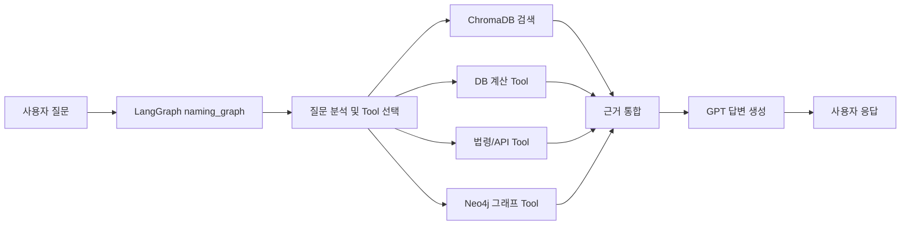

# 조건 기반 맞춤 작명 QA 시스템

> 기준일: 2026-06-17  
> 목적: 브랜치 병합으로 추가된 GPT 평가, Qwen 파인튜닝 평가, GPT vs Qwen 비교, sLLM 실험 내용을 실제 프로젝트 구조 기준으로 정리한 최종 결과 문서이다.  
> 작성 원칙: 실제 프로젝트 구조와 저장소 산출물을 기준으로 정리하며, 운영 Pipeline과 실험 트랙을 구분한다.

---

## 0. 참고 기준 문서와 확인 대상

이 문서는 기존 통합 문서에 최근 병합된 평가 및 파인튜닝 자료를 추가 반영하기 위해 작성했다. 기준이 되는 문서와 파일은 다음과 같다.

| 구분 | 기준 파일 | 반영 목적 |
|---|---|---|
| GPT Pipeline 평가 | `docs/평가/GPT_파이프라인_평가_보고서.md` | 운영 Pipeline의 정량 평가 결과 반영 |
| Qwen 파인튜닝 평가 | `docs/평가/Qwen_파인튜닝_평가_보고서.md` | sLLM 단독 응답 성능과 한계 반영 |
| GPT vs Qwen 비교 | `docs/평가/GPT_vs_Qwen_비교_보고서.md` | 운영 모델 선정 근거 반영 |
| sLLM 실험 문서 | `docs/llm/sLLM_실험/sLLM_파인튜닝_보고서.md` | 파인튜닝 실험 배경과 개선 방향 반영 |
| sLLM 전략 문서 | `docs/llm/sLLM_실험/sLLM_파인튜닝_전략.md` | 운영 모델과 sLLM 실험 트랙 분리 기준 참고 |
| 파인튜닝 실행 가이드 | `finetuning/README.md` | 학습 방식, 데이터 구성, 실행 흐름 참고 |
| 핵심 Pipeline 코드 | `src/graph/naming_graph.py` | LangGraph 처리 흐름과 모델 설정 확인 |
| Tool 계층 | `src/mcp/*.py` | 검색, 계산, 법령, 그래프 Tool 구성 확인 |
| 벡터 DB | `data/chroma/` | 운영 ChromaDB 컬렉션과 적재 건수 확인 |

문서 구성 순서는 `문제 정의 → 설계 원칙 → 운영 아키텍처 → 데이터 정제 → ChromaDB/Neo4j/Tool → ReAct 처리 → GPT 평가 → Qwen 실험 → 비교 결론` 흐름을 따른다.

---

## 1. 프로젝트 개요

본 프로젝트는 사용자의 작명 조건을 입력받아 한자, 수리, 오행, 법령, 순우리말 이름, 논문 기반 정보를 함께 검토하고 이름 후보를 추천하는 조건 기반 맞춤 작명 QA 시스템이다.

단순히 LLM이 이름을 생성하는 방식이 아니라, 정제된 문서 데이터와 그래프 데이터, 계산 Tool, 법령 검색 Tool을 결합한 Pipeline 기반 QA 구조로 설계했다.

| 항목 | 내용 |
|---|---|
| 프로젝트명 | 조건 기반 맞춤 작명 QA 시스템 |
| 핵심 목적 | 사용자의 조건에 맞는 이름 후보를 근거 기반으로 추천 |
| 운영 기본 모델 | `gpt-5.4-mini` |
| 운영 구조 | LangGraph ReAct Pipeline + ChromaDB + Neo4j + Tool |
| 실험 트랙 | Qwen3.5-4B LoRA 파인튜닝 |
| 최종 판단 | 운영 안정성은 GPT Pipeline이 우세, Qwen은 실험 및 향후 Hybrid 후보 |

---

## 2. 문제 정의와 설계 원칙

작명 도메인은 단순 문장 생성보다 검증 가능한 근거와 조건 충족이 중요하다. 이름 추천 과정에서는 다음 조건들이 함께 고려되어야 한다.

- 성씨와 이름의 한자 획수
- 수리 길흉
- 발음오행과 자원오행
- 인명용 한자 여부
- 법령상 사용 가능성
- 순우리말 이름 후보
- 논문 기반 작명 요소
- 사용자가 입력한 성별, 선호 음, 의미 조건

따라서 시스템은 LLM 단독 생성 방식이 아니라 다음 원칙으로 구성했다.

| 설계 원칙 | 설명 |
|---|---|
| 근거 기반 응답 | 정제 데이터, ChromaDB, Neo4j, Tool 호출 결과를 응답 근거로 사용 |
| 계산 분리 | 획수, 수리, 오행 조합 등 규칙 기반 판단은 별도 Tool에서 처리 |
| 검색 분리 | 한자, 법령, 논문, 순우리말 데이터는 ChromaDB 검색으로 처리 |
| 관계 탐색 분리 | 한자와 오행 관계는 Neo4j 그래프에서 탐색 |
| 생성 통제 | LLM은 직접 지식을 꾸며내는 역할이 아니라 검색 및 계산 결과를 종합하는 역할 |

---

## 3. 전체 운영 아키텍처

운영 Pipeline은 사용자의 질문을 LangGraph에서 분석한 뒤, 필요한 Tool을 선택적으로 호출하고 최종 답변을 생성한다.

핵심은 ChromaDB, Neo4j, Tool 계층이 각각 독립적으로 존재하고, LangGraph가 질의 목적에 따라 필요한 기능을 조합한다는 점이다.

---

## 4. Pipeline과 LangGraph 처리 구조

운영 Pipeline의 핵심 파일은 `src/graph/naming_graph.py`이다. 이 파일은 질문 분석, Tool 호출, 답변 생성, 검증 흐름을 하나의 그래프로 구성한다.

| 단계 | 역할 | 주요 내용 |
|---|---|---|
| Router | 질문 의도 분석 | 한자, 법령, 순우리말, 수리, 오행, 논문 등 필요한 Tool 판단 |
| Tool 실행 | 근거 수집 | ChromaDB, 계산 Tool, 법령 Tool, 그래프 Tool 호출 |
| Generate | 답변 생성 | 수집된 근거를 바탕으로 작명 답변 작성 |
| Verify | 응답 점검 | 조건 누락, 근거 부족, Tool 사용 여부 확인 |

운영 모델 설정은 다음과 같이 구성되어 있다.

| 역할 | 모델 | 주요 설정 |
|---|---|---|
| Router | `gpt-5.4-mini` | temperature 0, max_tokens 1024 |
| Generate | `gpt-5.4-mini` | temperature 0.7, max_tokens 8192 |
| Verify | `gpt-5.4-mini` | temperature 0, max_tokens 2048 |

반복 횟수는 `MAX_ITERATIONS = 5`로 제한되어 있으며, 무한 반복을 방지하면서도 복합 질의에 대해 여러 Tool을 호출할 수 있도록 설계되어 있다.

---

## 5. 데이터 정제와 저장 구조

프로젝트의 데이터는 원천 자료를 정제한 뒤 `data/processed/` 아래 JSON 문서 형태로 저장한다. ChromaDB에 적재되는 문서는 대부분 `id`, `document`, `metadata` 구조를 따른다.

| 파일 | 건수 | 용도 |
|---|---:|---|
| `data/processed/hanja_documents.json` | 2,420 | 정제 완료된 인명용 한자 메인 데이터 |
| `data/processed/hanja2_candidate_documents.json` | 6,564 | 한자 확장 후보군 데이터 |
| `data/processed/ohaeng_documents.json` | 125 | 오행 조합 및 관계 데이터 |
| `data/processed/suri_documents.json` | 81 | 81수리 길흉 데이터 |
| `data/processed/law_articles.json` | 250 | 이름 관련 법령 조문 데이터 |
| `data/processed/urimalsam_names.json` | 301 | 순우리말 이름 후보 데이터 |
| `data/processed/paper_documents.json` | 264 | 작명 관련 논문 기반 문서 |

한자 데이터는 전체 후보를 무조건 운영 DB에 반영하지 않고, 검증 수준에 따라 메인 데이터와 확장 후보군을 구분했다.

| 구분 | 설명 |
|---|---|
| 메인 한자 데이터 | 의미, 음, 획수, 발음오행, 자원오행이 운영 기준에 맞게 정제된 데이터 |
| 확장 후보군 데이터 | 원본 PDF에서 메인 데이터에 포함되지 않은 한자를 후보군으로 정리한 데이터 |
| 운영 판단 | 정제 신뢰도가 높은 메인 한자 데이터를 기본 운영 기준으로 사용 |

이 구조는 처음부터 2,420건만 사용하기 위해 만든 것이 아니라, 전체 인명용 한자 후보를 정리한 뒤 운영 안정성 기준에 맞춰 메인 데이터와 후보군을 분리한 결과이다.

---

## 6. ChromaDB, Neo4j, Tool 계층

### 6.1 ChromaDB 컬렉션

현재 운영 ChromaDB에는 다음 컬렉션이 구성되어 있다.

| 컬렉션 | 건수 | 설명 |
|---|---:|---|
| `hanja_col` | 2,438 | 한자 검색 컬렉션 |
| `law_col` | 248 | 법령 조문 검색 컬렉션 |
| `ohaeng_col` | 125 | 오행 관계 검색 컬렉션 |
| `paper_col` | 264 | 논문 기반 검색 컬렉션 |
| `suri_col` | 81 | 81수리 검색 컬렉션 |
| `urimalsam_col` | 301 | 순우리말 이름 검색 컬렉션 |
| 합계 | 3,457 | 운영 검색 대상 문서 수 |

`hanja_col`의 2,438건은 운영 ChromaDB에 적재된 검색 문서 수이며, 메인 한자 정제 파일인 `hanja_documents.json`의 2,420건과는 저장 및 적재 기준 차이로 구분해서 확인해야 한다.

`law_articles.json`은 원천 정제 파일 기준 250건이며, 운영 ChromaDB의 `law_col`은 중복 ID 2건이 제외되어 248건으로 적재되어 있다.

### 6.2 Neo4j 그래프

Neo4j는 한자, 오행, 의미, 관계 정보를 그래프로 탐색하기 위한 구조로 사용한다. 복합 조건 질의에서 특정 오행에 맞는 한자 후보를 찾거나 한자 간 관계를 확인하는 데 활용된다.

### 6.3 Tool 구성

프로젝트에는 총 16개 Tool이 구성되어 있다. 파일명에는 `server`가 포함되어 있지만, Pipeline 내부에서는 각 Tool 함수를 직접 import하여 호출하는 구조이므로 발표나 문서에서는 `Tool 그룹` 또는 `Tool 모듈`로 표현하는 것이 정확하다.

| Tool 그룹 | 개수 | Tool |
|---|---:|---|
| RAG 검색 Tool | 2 | `search_rag`, `list_collections` |
| DB 계산 Tool | 5 | `get_surname_strokes`, `calculate_name_suri`, `find_lucky_strokes`, `lookup_ohaeng_combo`, `search_name_stats` |
| 법령/API Tool | 3 | `search_law`, `get_law_article`, `verify_korean_word` |
| 그래프 Tool | 6 | `check_graph_status`, `lookup_hanja`, `check_person_name_hanja`, `get_ohaeng_relations`, `recommend_hanja_by_ohaeng`, `answer_graph_query` |

---

## 7. 주요 질의 처리 시나리오

시스템은 질문의 성격에 따라 Tool을 다르게 조합한다.

| 질의 유형 | 처리 방식 |
|---|---|
| 한자 이름 추천 | 한자 검색, 획수 계산, 오행 검토, 그래프 탐색 |
| 수리 기반 추천 | 성씨 획수 확인, 이름 획수 조합 계산, 81수리 길흉 검토 |
| 오행 조건 추천 | 발음오행 및 자원오행 검색, 오행 조합 Tool 사용 |
| 법령 확인 | 법령 조문 검색 및 전문 조회 |
| 순우리말 이름 | 순우리말 이름 컬렉션 검색 |
| 논문 근거 질의 | 논문 문서 컬렉션 검색 후 요약 |

이 방식은 질문마다 모든 DB를 일괄 검색하는 구조가 아니라, 필요한 Tool을 선택적으로 호출하여 응답 근거를 구성하는 구조이다.

---

## 8. GPT Pipeline 평가 결과

운영 Pipeline은 11개 평가 케이스를 기준으로 검증되었다. 평가는 GPT 기반 Pipeline이 실제 Tool을 호출해 조건을 얼마나 정확하게 처리하는지 확인하는 방식으로 진행되었다.

| 항목 | 결과 |
|---|---:|
| 평가 케이스 수 | 11 |
| 성공 처리 | 11 / 11 |
| 조건 충족도 | 4.55 |
| 근거성 | 3.82 |
| 답변 완성도 | 3.91 |
| 전체 평균 | 4.09 |

주요 강점은 다음과 같다.

- 81수리 기반 질의에서 높은 조건 충족도를 보였다.
- 그래프 DB 기반 한자 관계 질의에서 안정적인 Tool 호출 흐름을 보였다.
- 순우리말 이름 추천에서 근거 기반 응답 품질이 높았다.
- 법령 및 논문 질의는 RAG 기반 근거 제시가 가능했다.

보완이 필요한 부분은 다음과 같다.

- 한자 의미, 길수, 오행 조건이 동시에 걸린 복합 질의에서는 추가 필터링 로직이 필요하다.
- 검색 결과가 충분하지 않은 경우 답변 완성도가 낮아질 수 있다.
- 추천 후보의 최종 검증을 더 촘촘하게 적용할 필요가 있다.

최종적으로 GPT Pipeline은 운영 환경에서 사용할 수 있는 기본 구조로 판단되었다.

---

## 9. Qwen 파인튜닝 실험 결과

Qwen 실험은 운영 Pipeline과 별도로 진행된 sLLM 파인튜닝 트랙이다. 목적은 소형 모델이 작명 도메인의 응답 형식과 일부 지식을 얼마나 학습할 수 있는지 확인하는 것이다.

| 항목 | 내용 |
|---|---|
| 모델 | Qwen3.5-4B |
| 방식 | LoRA / QLoRA 기반 파인튜닝 |
| 실행 모델명 | `qwen-lora` |
| 현재 저장소 기준 학습 데이터 | `data/processed/finetune_data.json` 311건 |
| 평가 방식 | RAG 없이 파인튜닝 모델 단독 응답 |
| 평가 케이스 | 11개 |

평가 결과는 다음과 같다.

| 항목 | 결과 |
|---|---:|
| 유효 평가 케이스 | 10 / 11 |
| 타임아웃 | 1건 |
| 사실 정확도 | 1.20 |
| 근거성 | 1.50 |
| 답변 완성도 | 2.20 |
| 전체 평균 | 1.63 |

`1.63`은 타임아웃 케이스 1건을 제외한 유효 10건 기준 평균이다. Raw 평가 JSON 전체 11건을 0점 처리된 타임아웃까지 포함해 단순 평균하면 수치가 달라질 수 있으므로, 평가 보고서 기준과 동일하게 유효 케이스 기준으로 해석한다.

Qwen 파인튜닝은 답변 형식과 말투 학습에는 의미가 있었지만, 작명 도메인의 핵심인 계산, 법령, 한자, 오행, 논문 근거를 안정적으로 처리하기에는 한계가 있었다.

특히 다음 문제가 확인되었다.

- 수리 계산과 길흉 판단을 안정적으로 수행하지 못했다.
- 오행 관계와 한자 의미에서 오류가 발생했다.
- 법령 및 논문 근거를 실제 자료 기반으로 제시하지 못했다.
- 복합 조건 질의에서 타임아웃이 발생했다.

따라서 Qwen 파인튜닝 모델은 현재 단계에서 운영 기본 모델로 사용하기보다는 향후 Hybrid 구조의 보조 모델 후보로 보는 것이 적절하다.

---

## 10. GPT Pipeline vs Qwen 비교 결론

두 방식은 동일한 목적을 대상으로 평가했지만 구조가 다르다.

| 비교 항목 | GPT Pipeline | Qwen 파인튜닝 |
|---|---|---|
| 구조 | RAG + Tool + LangGraph | 파인튜닝 모델 단독 응답 |
| 모델 | `gpt-5.4-mini` | Qwen3.5-4B LoRA |
| 평가 케이스 | 11개 | 11개 |
| 성공 처리 | 11 / 11 | 10 / 11 |
| 전체 평균 | 4.09 | 1.63 |
| 강점 | 근거 기반 검색, 계산, Tool 조합 | 응답 형식 학습, 경량화 가능성 |
| 한계 | 복합 조건 추가 검증 필요 | 사실성, 계산, 근거성 부족 |
| 운영 적합성 | 높음 | 낮음 |

결론적으로 현재 프로젝트의 운영 기준은 GPT Pipeline이 적합하다. Qwen 파인튜닝은 소형 모델 실험으로서 의미가 있지만, 작명 시스템처럼 사실성과 계산 정확도가 중요한 도메인에서는 단독 운영보다 외부 Tool과 결합하는 Hybrid 구조가 필요하다.

---

## 11. 현재 범위와 개선 방향

현재 시스템은 조건 기반 작명 QA를 운영 가능한 Pipeline 형태로 구성했으며, 데이터 정제와 Tool 호출 구조를 통해 단순 생성형 응답보다 안정적인 결과를 제공한다.

향후 개선 방향은 다음과 같다.

| 개선 영역 | 내용 |
|---|---|
| 복합 조건 필터링 | 한자 의미, 길수, 오행, 성별 조건을 동시에 만족하는 후보 검증 강화 |
| 한자 후보군 운영 판단 | 확장 후보군을 운영 DB에 반영할지 추가 테스트 필요 |
| 답변 검증 강화 | 생성 답변의 근거 누락, 계산 오류, 조건 누락 자동 점검 |
| Qwen Hybrid | 파인튜닝 모델을 직접 운영하기보다 Tool 기반 보조 응답 모델로 활용 검토 |
| 평가 자동화 | GPT Pipeline과 sLLM 실험 결과를 동일 기준으로 반복 평가 |

---

## 12. 최종 산출물 기준

현재 프로젝트의 최종 산출물은 다음 범위로 정리할 수 있다.

| 구분 | 산출물 |
|---|---|
| 데이터 | 정제 JSON, ChromaDB 컬렉션, Neo4j 그래프 |
| Pipeline | `src/graph/naming_graph.py` |
| Tool | `src/mcp/*.py` |
| 평가 문서 | GPT Pipeline 평가, Qwen 평가, GPT vs Qwen 비교 |
| 실험 문서 | sLLM 파인튜닝 보고서, 파인튜닝 README |
| 통합 문서 | `docs/기획/프로젝트_결과.md` |

운영 관점에서는 GPT Pipeline을 기준으로 발표하고, Qwen 파인튜닝은 비교 실험 및 향후 확장 방향으로 설명하는 것이 가장 자연스럽다.

---

## 13. 최종 요약

본 프로젝트는 이름 추천을 LLM 단독 생성으로 처리하지 않고, 정제 데이터, ChromaDB, Neo4j, 계산 Tool, 법령 Tool을 결합한 Pipeline으로 구현했다.

검증 결과 GPT Pipeline은 11개 평가 케이스에서 전체 평균 4.09점을 기록하며 운영 후보로 적합한 성능을 보였다. 반면 Qwen3.5-4B LoRA 파인튜닝 모델은 전체 평균 1.63점으로, 형식 학습에는 의미가 있었지만 사실성, 계산 정확도, 근거성 측면에서는 단독 운영이 어렵다는 결론이 도출되었다.

따라서 현재 운영 기준은 GPT Pipeline으로 두고, Qwen 파인튜닝은 향후 Hybrid 구조나 경량 응답 보조 모델로 확장하는 방향이 적절하다.
