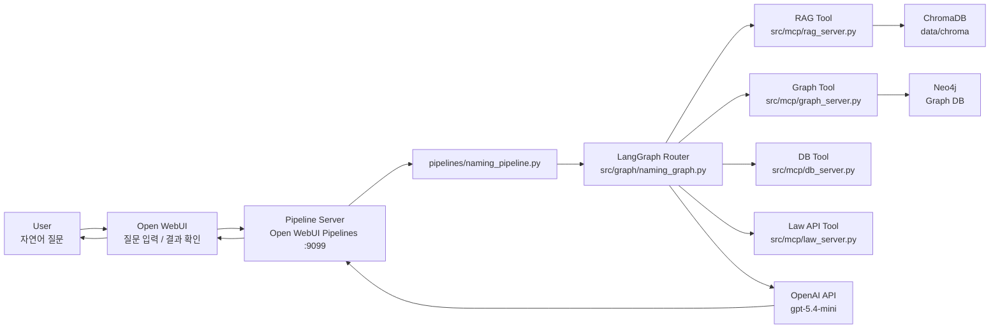
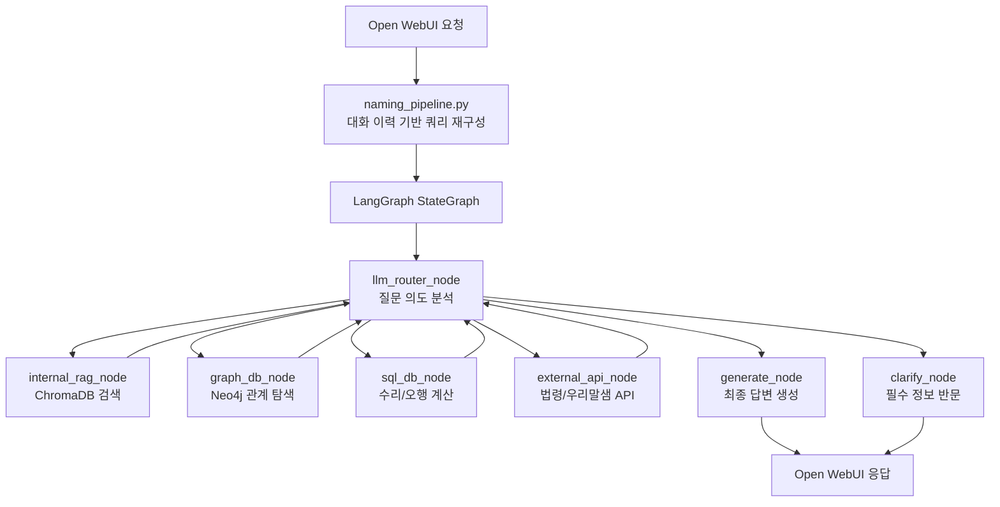

# 조건 기반 맞춤 작명 QA 시스템 통합 문서

> 기준일: 2026-06-17  
> 문서 목적: 개별 `docs` 문서를 열지 않아도 프로젝트의 목적, 시스템 구조, 데이터 흐름, 구현 산출물, 테스트 결과를 이해할 수 있도록 정리한 단일 통합 문서  
> 검증 기준: 실제 저장소 구조, `docker-compose.yml`, 핵심 Python 코드, `data/raw`, `data/processed`, `data/chroma`, 테스트 결과 JSON, 기존 프로젝트 문서

---

## 1. 프로젝트 한눈에 보기

조건 기반 맞춤 작명 QA 시스템은 사용자가 성씨, 오행, 획수, 뜻, 발음, 순우리말 여부 등을 자연어로 입력하면, Pipeline Server가 필요한 데이터와 Tool을 조합해 근거 기반 이름 추천 또는 작명 관련 답변을 생성하는 프로젝트다.

이 프로젝트는 이름을 단순히 생성하는 챗봇이 아니다. 작명 도메인은 한자의 뜻과 음, 획수, 오행, 인명용 한자 허용 여부, 법령 근거, 순우리말 실제 존재 여부, 이름 트렌드까지 함께 고려해야 한다. 따라서 LLM이 바로 답을 생성하는 방식보다, 검색과 계산, 그래프 탐색, 외부 API 검증을 거친 뒤 답변을 생성하는 구조가 필요하다.

| 항목 | 현재 구현 기준 |
|---|---|
| 프로젝트명 | 조건 기반 맞춤 작명 QA 시스템 |
| 프로젝트 성격 | LLM을 연동한 내외부 문서 기반 질의응답 및 추천 Pipeline |
| 핵심 범위 | Open WebUI에 연결되는 Pipeline Server와 내부 LangGraph/RAG/Graph/MCP 처리 구조 |
| 사용자 접점 | Open WebUI |
| Pipeline 진입점 | `pipelines/naming_pipeline.py` |
| 핵심 그래프 | `src/graph/naming_graph.py` |
| Vector DB | ChromaDB, `data/chroma` |
| Graph DB | Neo4j, 별도 실행 대상 |
| Tool 계층 | `src/mcp`의 RAG, DB, Law API, Graph Tool |
| 운영 LLM | `gpt-5.4-mini` |
| 평가 방식 | 11개 케이스 LLM-as-a-Judge 평가 |

현재 저장소는 완성형 웹서비스 전체를 담은 저장소라기보다, Open WebUI에 연결되는 Pipeline Server와 그 내부 처리 구조를 중심으로 관리하는 프로젝트다. 실제 Docker 운영 구상은 Open WebUI, Pipeline Server, Neo4j가 함께 동작하는 형태이며, 이 저장소의 `docker-compose.yml`에는 Pipeline Server인 `pipelines` 서비스가 정의되어 있다.

---

## 2. 문제 정의와 기획 배경

작명은 생성형 AI가 임의로 예쁜 이름을 만들어내는 작업처럼 보일 수 있지만, 실제로는 여러 조건을 만족해야 하는 검증형 문제에 가깝다. 예를 들어 “김씨 성에 어울리고, 목오행이며, 吉수이고, 밝은 뜻을 가진 한자 이름”을 추천하려면 아래 조건을 동시에 확인해야 한다.

| 조건 | 필요한 근거 |
|---|---|
| 성씨와 이름의 획수 | 성씨 획수, 이름 한자 획수, 81수리 계산 |
| 오행 흐름 | 성씨 오행, 한자 자원오행, 오행 상생/상극 관계 |
| 한자 의미 | 한자별 뜻음, 획수, 자원오행 |
| 법적 사용 가능성 | 가족관계등록법, 인명용 한자 관련 규정 |
| 순우리말 여부 | 실제 순우리말 이름 후보와 뜻풀이 |
| 이름 트렌드 | 작명 관련 논문과 이름 통계 자료 |

일반적인 RAG만으로는 이 요구를 모두 처리하기 어렵다. 한자 뜻과 법령은 문서 검색이 적합하지만, 오행 상생/상극은 관계 탐색이 필요하고, 81수리는 규칙 기반 계산이 필요하다. 순우리말 이름은 후보 데이터와 외부 사전 검증을 함께 고려해야 한다. 이 때문에 본 프로젝트는 단일 검색 시스템이 아니라, Router가 질문 성격을 판단해 여러 Tool을 호출하는 Hybrid Pipeline 구조로 설계되었다.

---

## 3. 프로젝트의 핵심 설계 방향

본 프로젝트의 설계 방향은 “LLM 단독 생성”이 아니라 “근거 수집과 검증을 거친 생성”이다. 이름 추천 결과가 설득력을 가지려면 이름 후보와 함께 왜 추천했는지, 어떤 데이터에 근거했는지, 어떤 조건을 만족하는지 설명할 수 있어야 한다.

| 설계 방향 | 적용 내용 |
|---|---|
| 근거 기반 생성 | ChromaDB, Neo4j, DB 계산, 외부 API 결과를 모아 최종 답변 생성 |
| Hybrid RAG | Vector DB 검색과 Graph DB 관계 탐색을 함께 사용 |
| Tool 분리 | RAG, DB 계산, Law API, Graph 기능을 `src/mcp`로 분리 |
| Router 중심 흐름 | LangGraph Router가 질문 유형에 따라 필요한 Tool 선택 |
| 운영 안정성 | Open WebUI Pipelines 컨테이너에서 Tool 함수를 직접 import해 호출 |
| 설명 가능성 | 이름 추천 시 한자 뜻, 획수, 오행, 수리, 근거 데이터를 함께 제시 |

작명 도메인은 대중적 수요가 있으면서도 검증 가능한 데이터 기반 설명을 함께 요구하는 영역이다. 본 프로젝트는 이 점을 활용해 한자, 법령, 오행, 순우리말, 논문 데이터를 하나의 질의응답 흐름으로 묶었다.

---

## 4. 최종 시스템 아키텍처

### 4.1 전체 운영 구조

프로젝트의 실제 운영 구조는 사용자가 Open WebUI에서 질문을 입력하고, Open WebUI가 Pipeline Server를 호출하며, Pipeline Server 내부에서 LangGraph Router와 Tool들이 필요한 근거를 수집한 뒤 최종 답변을 반환하는 방식이다.



이 구조에서 Open WebUI는 사용자 입력과 결과 확인을 담당하고, Pipeline Server는 실제 질문 처리와 Tool 호출을 담당한다. Neo4j는 그래프 질의와 오행 관계 탐색을 위한 별도 서버로 전제된다.

### 4.2 Docker 기준 구조

현재 저장소의 `docker-compose.yml`에는 `pipelines` 서비스가 정의되어 있다. Open WebUI와 Neo4j는 실제 운영 환경의 별도 Docker 서비스 또는 외부 연결 대상으로 관리된다.

| 구성 요소 | 역할 | 현재 저장소 반영 방식 |
|---|---|---|
| Open WebUI | 사용자 질문 입력, 결과 확인 | 별도 Docker 서비스 또는 외부 연결 대상 |
| Pipeline Server | Open WebUI Pipelines 요청 처리 | `docker-compose.yml`의 `pipelines` 서비스 |
| Neo4j | 한자, 오행, 법령 관계 조회 | 별도 실행 대상, 저장소는 연결 코드와 인덱싱 코드 보유 |

`pipelines` 서비스는 `docker/Dockerfile.pipelines`를 사용해 빌드되며, 호스트의 `./pipelines`, `./src`, `./data`를 컨테이너 내부에 마운트한다.

| 호스트 경로 | 컨테이너 경로 | 목적 |
|---|---|---|
| `./pipelines` | `/app/pipelines` | Open WebUI Pipeline 진입점 |
| `./src` | `/app/src_naming` | LangGraph 및 MCP Tool 코드 |
| `./data` | `/app/data` | 정제 데이터와 ChromaDB 저장소 |
| `hf-cache` | `/root/.cache/huggingface` | 임베딩 모델 캐시 |

Pipeline Server는 `9099:9099` 포트로 노출된다.

### 4.3 Pipeline 내부 처리 흐름

Pipeline 내부에서는 `naming_pipeline.py`가 Open WebUI 요청을 받고, `naming_graph.py`의 LangGraph StateGraph를 호출한다. StateGraph는 Router와 여러 Tool 노드를 반복적으로 오가며 필요한 정보를 수집한다.



Router는 필요한 정보가 충분하지 않으면 RAG, Graph, DB, API Tool을 호출하고 다시 Router로 돌아온다. 최대 반복 횟수는 `MAX_ITERATIONS = 5`로 제한되어 있으며, 반복 초과 시 강제 generate로 흐르도록 구현되어 있다.

---

## 5. 저장소와 폴더 구조

프로젝트 루트에는 Pipeline 구현, 데이터, 문서, 테스트, 실험 코드가 분리되어 있다.

| 경로 | 역할 |
|---|---|
| `docker-compose.yml` | Pipeline Server Docker 서비스 정의 |
| `docker/Dockerfile.pipelines` | Open WebUI Pipelines 기반 컨테이너 빌드 정의 |
| `pipelines/` | Open WebUI Pipelines 진입점 |
| `src/graph/` | LangGraph StateGraph와 Neo4j 인덱싱 코드 |
| `src/mcp/` | RAG, DB, Law API, Graph Tool 구현 |
| `src/data/` | 데이터 수집, OCR, ChromaDB 인덱싱 스크립트 |
| `src/preprocess/` | 한자/논문 등 전처리 보조 스크립트 |
| `data/raw/` | 원천 데이터 |
| `data/processed/` | 정제 산출물 |
| `data/chroma/` | ChromaDB persistent 저장소 |
| `docs/` | 기획, 파이프라인, 데이터, API, 평가, 운영 문서 |
| `tests/` | Pipeline 테스트와 RAG 평가 |
| `finetuning/` | sLLM 및 파인튜닝 실험 코드 |

이 폴더 구조에서 운영 중심 경로는 `pipelines`, `src/graph`, `src/mcp`, `data/processed`, `data/chroma`, `tests`다. `docs`는 개발 과정과 산출물 설명을 보존하는 문서 영역이며, `finetuning`은 현재 운영 Pipeline과 별도의 실험 트랙으로 보는 것이 적절하다.

---

## 6. 주요 구현 파일과 역할

### 6.1 Open WebUI Pipeline 진입점

`pipelines/naming_pipeline.py`는 Open WebUI Pipelines 서버가 호출하는 진입점이다. 이 파일은 FastMCP 서버를 실제로 띄우지 않아도 MCP Tool 파일들을 import할 수 있도록 `fastmcp` 스텁을 주입하고, `src/graph/naming_graph.py`의 `build_graph()`를 호출해 LangGraph를 준비한다.

주요 책임은 다음과 같다.

| 구성 | 역할 |
|---|---|
| `_stub_fastmcp()` | 컨테이너 내부에서 MCP 서버 파일이 직접 import될 수 있도록 FastMCP 데코레이터를 no-op 처리 |
| `on_startup()` | `src_naming/mcp`, `src_naming/graph` 경로 추가 후 LangGraph 빌드 |
| `_resolve_query()` | 대화 이력, 추가 추천 요청, clarify 응답을 반영해 최종 질의 재구성 |
| `pipe()` | Open WebUI 요청을 받아 State를 만들고 `self.app.invoke(state)` 실행 |

대화형 작명 요청에서는 이전 추천 결과와 겹치지 않게 해달라는 요청, “2개 더 추천” 같은 추가 요청, clarify에 대한 사용자 답변이 자주 발생한다. `naming_pipeline.py`는 이런 대화 맥락을 그래프에 전달하기 전에 정리하는 역할을 한다.

### 6.2 LangGraph StateGraph

`src/graph/naming_graph.py`는 프로젝트의 핵심 처리 로직이다. Router, Tool 노드, clarify, generate, 검증과 후처리 로직이 이 파일에 모여 있다.

| 구성 | 역할 |
|---|---|
| `NamingState` | query, context, next_action, answer, iterations, used_tools, collections 등 그래프 상태 정의 |
| `llm_router_node` | 사용자 질문과 누적 context를 보고 다음 Tool 또는 generate/clarify 선택 |
| `internal_rag_node` | ChromaDB 컬렉션 검색 및 후보 샘플링 |
| `graph_db_node` | Neo4j 기반 한자/오행 관계 조회 |
| `sql_db_node` | 81수리, 吉수, 오행 조합 계산 |
| `external_api_node` | 국가법령정보 API, 우리말샘 API 호출 |
| `clarify_node` | 성별, 이름 유형, 성씨 한자 등 필수 정보 반문 |
| `generate_node` | 수집된 근거를 바탕으로 최종 이름 추천 또는 답변 생성 |
| `build_graph()` | StateGraph 노드와 조건부 edge 구성 |

Router, Generate, Verify 역할은 모두 `gpt-5.4-mini`를 사용한다. Router와 Verify는 낮은 temperature로 판단 안정성을 확보하고, Generate는 이름 추천의 다양성을 위해 상대적으로 높은 temperature를 사용한다.

| 역할 | 모델 | temperature | max_tokens |
|---|---|---:|---:|
| Router | `gpt-5.4-mini` | 0 | 1024 |
| Generate | `gpt-5.4-mini` | 0.7 | 8192 |
| Verify | `gpt-5.4-mini` | 0 | 2048 |

### 6.3 MCP Tool 계층

`src/mcp`에는 4개 Tool 파일이 있다. 파일명은 MCP 서버 형태지만, 현재 Pipeline Server에서는 FastMCP 서버 프로세스를 별도로 실행하지 않고 Python 함수를 직접 import해 호출한다.

| 파일 | 주요 역할 |
|---|---|
| `src/mcp/rag_server.py` | ChromaDB 컬렉션 검색, 한자/순우리말 후보 샘플링 |
| `src/mcp/db_server.py` | 81수리 계산, 吉수 획수 조합 탐색, 오행 조합 조회, 이름 통계 조회 |
| `src/mcp/law_server.py` | 국가법령정보 API, 우리말샘 API 호출 |
| `src/mcp/graph_server.py` | Neo4j 기반 한자/오행/법령 관계 조회 |

이 분리는 유지보수 측면에서 중요하다. 예를 들어 RAG 검색 정책을 바꾸려면 `rag_server.py`를 중심으로 수정하고, 수리 계산 규칙은 `db_server.py`, 그래프 질의는 `graph_server.py`에서 관리할 수 있다.

---

## 7. 데이터 수집과 정제 흐름

본 프로젝트는 원천 데이터를 그대로 LLM에 넣지 않는다. 원천 자료를 작명 QA에 필요한 단위로 정제하고, 정제 산출물을 ChromaDB, Neo4j, 또는 계산 Tool에서 사용할 수 있도록 변환한다.

```text
data/raw
  -> src/data, src/preprocess 전처리 스크립트
  -> data/processed 정제 산출물
  -> data/chroma ChromaDB 컬렉션 또는 Neo4j 그래프
  -> LangGraph Tool 호출
  -> gpt-5.4-mini 최종 답변 생성
```

### 7.1 원천 데이터

`data/raw`에는 작명 도메인에 필요한 PDF, JSON, XLS, CSV, Unihan 텍스트 자료가 들어 있다.

| 원천 영역 | 주요 파일 |
|---|---|
| 한자/인명용 한자 | `peoplehanja.json`, `hanja.pdf`, Unihan TXT 파일 |
| 오행 자료 | `자원오행 발음오행구분표.xlsx`, `yinyang.json` |
| 81수리 | `81suri.json` |
| 법령 | 가족관계등록법 PDF, 가족관계등록규칙 PDF |
| 순우리말 | `정겨운우리말.pdf`, `src/data/crawl_urimalsam.py`를 통한 웹 수집 경로 |
| 이름 통계 | `2016_2026상위_출생신고_이름_현황.xls` |
| 논문 | 작명/이름 트렌드 관련 국내 논문 PDF |
| 성씨 | `성씨 유래 정보.csv` |

### 7.2 정제 산출물

`data/processed`는 운영 Pipeline이 직접 참조하는 핵심 산출물 영역이다.

| 정제 산출물 | 건수 | 사용처 |
|---|---:|---|
| `hanja_documents.json` | 2,420 | 추천용 인명 한자 기본 후보군 |
| `hanja2_candidate_documents.json` | 6,564 | 확장 한자 후보군, 운영 기본값은 아님 |
| `suri_documents.json` | 81 | 81수리 설명 및 계산 근거 |
| `ohaeng_documents.json` | 125 | 오행 조합 해석 |
| `law_articles.json` | 250 | 법령 조문 검색 원천 |
| `urimalsam_names.json` | 301 | 순우리말 이름 추천 후보 |
| `paper_documents.json` | 264 | 작명 논문 본문/표 청크 |
| `surname_ohaeng.json` | 258 | 성씨 오행 fallback 사전 |
| `rag_eval_result.json` | 11 | RAG 평가 결과 |
| `finetune_data.json` | 296 | sLLM 실험용 학습 데이터 |

OCR 관련 산출물은 `data/processed/ocr`에 보존되어 있다. 현재 운영 RAG의 직접 입력이라기보다, 순우리말 자료 보강과 OCR 처리 이력을 남기는 성격이 강하다.

### 7.3 ChromaDB 컬렉션

`data/chroma/chroma.sqlite3` 기준으로 실제 적재된 컬렉션은 6개다.

| 컬렉션 | 적재 건수 | 역할 |
|---|---:|---|
| `hanja_col` | 2,438 | 인명용 한자 속성 검색 |
| `law_col` | 248 | 가족관계등록법 및 인명용 한자 법령 검색 |
| `ohaeng_col` | 125 | 오행 조합 설명 검색 |
| `paper_col` | 264 | 작명 논문 및 이름 트렌드 근거 검색 |
| `suri_col` | 81 | 81수리 해석 검색 |
| `urimalsam_col` | 301 | 순우리말 이름 추천 |

`hanja_documents.json`은 추천용 인명 한자 2,420건이고, `hanja_col`은 성씨 보조 데이터 등을 포함해 전체 2,438건이다. `law_articles.json`은 250건이지만 `law_col`은 248건으로 확인되며, 이는 적재 과정에서 중복 ID 2건이 제외된 결과로 해석한다.

### 7.4 Neo4j 그래프 구조

Neo4j는 한자와 오행 관계를 구조적으로 탐색하기 위한 Graph DB다. 저장소에는 Neo4j 서버 자체가 포함된 것이 아니라, 연결 코드와 인덱싱 코드가 포함되어 있다.

| 노드 | 설명 |
|---|---|
| `Hanja` | 한자 문자, 발음, 획수, 의미 |
| `Sound` | 한글 독음 |
| `Stroke` | 획수 |
| `Ohaeng` | 목/화/토/금/수 오행 |
| `Law` | 인명용 한자 관련 법령 근거 |

| 관계 | 의미 |
|---|---|
| `HAS_SOUND` | 한자와 발음 연결 |
| `HAS_STROKES` | 한자와 획수 연결 |
| `BELONGS_TO` | 한자와 자원오행 연결 |
| `PERMITTED_BY` | 한자와 법령 근거 연결 |
| `GENERATES` | 오행 상생 관계 |
| `CONTROLS` | 오행 상극 관계 |

그래프 적재는 `src/graph/index_hanja_neo4j.py`와 한자 관련 문서에서 관리되며, 질의는 `src/mcp/graph_server.py`의 Tool 함수들이 담당한다.

### 7.5 임베딩과 청킹 전략

ChromaDB에 적재되는 문서는 데이터 성격에 따라 청킹 단위를 다르게 둔다. 이름 추천과 검증에서는 한자 1자, 수리 번호 1개, 오행 조합 1개, 순우리말 이름 1개처럼 의미 단위가 작고 명확한 데이터를 많이 사용한다. 반면 법령과 논문은 조문이나 본문/표 단위로 나누어 검색 맥락을 유지한다.

| 컬렉션 | 청킹 기준 | 임베딩/처리 기준 |
|---|---|---|
| `hanja_col` | 한자 1자 = 문서 1건 | `jhgan/ko-sroberta-multitask` |
| `suri_col` | 수리 번호 1개 = 문서 1건 | `jhgan/ko-sroberta-multitask` |
| `ohaeng_col` | 오행 3요소 조합 1개 = 문서 1건 | `jhgan/ko-sroberta-multitask` |
| `law_col` | 법령 조항 단위 | PDF 텍스트 추출, 정규표현식 정제, KoNLPy 기반 한국어 전처리 |
| `urimalsam_col` | 순우리말 이름 1건 = 문서 1건 | 성별 태그와 뜻풀이 메타데이터 보존 |
| `paper_col` | 논문 본문 단락과 통계표 분리 | SentenceTransformer 직접 임베딩 후 ChromaDB에 수동 적재 |

임베딩 모델은 한국어 문장 검색에 맞춰 `jhgan/ko-sroberta-multitask`를 사용한다. `paper_col`은 일반 컬렉션과 달리 수동 임베딩으로 적재되어, 검색 시 embedding function 없이 컬렉션을 불러오는 구조를 사용한다.

---

## 8. 주요 질의 처리 시나리오

### 8.1 한자 이름 추천

한자 이름 추천은 가장 복합적인 흐름이다. 성씨, 성별, 이름 유형, 오행, 획수, 뜻 조건을 해석하고, RAG 검색과 DB 계산, 그래프 탐색을 조합한다.

```text
사용자 질문
  -> naming_pipeline.py에서 대화 이력 기반 질의 재구성
  -> llm_router_node가 필요한 Tool 판단
  -> internal_rag_node가 hanja_col, paper_col 등 검색
  -> sql_db_node가 吉수 또는 81수리 계산
  -> graph_db_node가 오행 관계와 인명용 한자 여부 조회
  -> generate_node가 근거 기반 이름 후보 생성
  -> 후처리 로직이 획수, 오행, 중복, 부적절 후보 보정
  -> Open WebUI로 최종 답변 반환
```

한자 이름 생성에는 단순 생성 이후에도 여러 보정 단계가 들어간다. 예를 들어 성씨 한자 표기 오류, 한자/한글 헤더 오류, 획수 표기 오류, 상극 이름, 중복 발음, 성씨 발음과 겹치는 이름 등을 후처리한다.

### 8.2 순우리말 이름 추천

순우리말 이름 추천은 `urimalsam_col`을 중심으로 동작한다. 성별 조건과 외자 여부가 있으면 후보 샘플링 단계에서 필터링을 적용한다.

```text
순우리말 이름 요청
  -> Router가 internal_rag 선택
  -> urimalsam_col에서 후보 검색 또는 샘플링
  -> 성별/음절 수 조건 반영
  -> generate_node가 후보 이름과 뜻풀이 생성
  -> 순우리말 후보 검증 및 중복 제거
```

이 흐름은 LLM이 존재하지 않는 순우리말을 임의 생성하는 문제를 줄이기 위해 후보 목록 기반으로 설계되어 있다.

### 8.3 81수리와 오행 계산

81수리와 오행 조합은 의미 검색보다 규칙 기반 계산이 중요한 영역이다. `db_server.py`는 성씨 획수와 이름 획수를 입력받아 4격을 계산하고, 吉수 조합을 역산하거나 오행 조합 결과를 조회한다.

| 질문 예시 | 주요 경로 |
|---|---|
| “성씨 8획, 이름 7획+6획일 때 81수리를 계산해줘” | `sql_db_node` -> `calculate_name_suri` |
| “8획 성씨에 맞는 吉수 조합을 알려줘” | `sql_db_node` -> `find_lucky_strokes` |
| “목화토 오행 조합이 좋은지 알려줘” | `sql_db_node` 또는 `ohaeng_col` |

### 8.4 법령과 외부 API 질의

법령 질의는 내부 `law_col` 검색과 외부 국가법령정보 API를 함께 사용할 수 있다. 순우리말 단어 검증에는 우리말샘 API가 사용된다.

| 질문 예시 | 주요 경로 |
|---|---|
| “인명용 한자 관련 법령을 찾아줘” | `law_col` 또는 `law_server.search_law` |
| “이 한자는 이름에 쓸 수 있나요?” | `graph_server.py`, `law_col` |
| “이 순우리말이 실제 단어인가요?” | `law_server.verify_korean_word` |

### 8.5 Neo4j 그래프 질의

오행 상생/상극 관계나 한자 속성의 구조적 조회는 Neo4j 경로를 사용한다.

| 질문 예시 | 주요 경로 |
|---|---|
| “목 오행의 상생 관계를 알려줘” | `graph_server.get_ohaeng_relations` |
| “이 한자의 오행과 발음을 알려줘” | `graph_server.lookup_hanja` |
| “화오행에 맞는 한자를 추천해줘” | `graph_server.recommend_hanja_by_ohaeng` |

---

## 9. 모델과 실험 범위

현재 운영 Pipeline의 기본 모델은 `gpt-5.4-mini`다. Router, Generate, Verify 단계가 같은 모델을 사용하지만, 역할별 temperature와 token 설정을 다르게 둔다.

sLLM과 파인튜닝 관련 파일은 `finetuning`과 `docs/llm/sLLM_실험`에 존재한다. 다만 현재 통합 문서에서는 sLLM을 운영 기본 모델로 설명하지 않는다. 해당 산출물은 모델 경량화 가능성을 검토하기 위한 별도 실험 트랙이며, 실제 운영 기준 설명은 `gpt-5.4-mini` 기반 Pipeline을 중심으로 한다.

---

## 10. 테스트 계획과 평가 결과

테스트는 Open WebUI 화면 자체의 사용성보다, Open WebUI에서 호출되는 Pipeline Server의 처리 품질을 검증하는 데 초점을 둔다. 평가 대상은 Router가 적절한 Tool을 선택하고, Tool들이 필요한 근거를 수집하며, 최종 답변이 그 근거에 기반해 생성되는지다.

`tests/rag_eval.py`는 GPT 기반 LLM-as-a-Judge 평가를 수행하며, 결과는 `data/processed/rag_eval_result.json`에 저장되어 있다. Judge 모델은 `gpt-5.4`이고, Pipeline 생성 모델은 `gpt-5.4-mini`다. 생성 모델보다 강한 Judge 모델을 사용해 자기 평가 편향을 줄이는 방식으로 구성되어 있다.

| 항목 | 결과 |
|---|---:|
| 평가 케이스 | 11개 |
| 답변 생성 성공률 | 11/11 |
| Context Relevance 평균 | 4.55 / 5 |
| Groundedness 평균 | 3.82 / 5 |
| Answer Relevance 평균 | 3.91 / 5 |
| 종합 평균 | 4.09 / 5 |

평가 케이스는 한자+수리 복합 추천, 오행 설명, 순우리말 추천, 법령 조문, 논문/트렌드, 그래프 DB 탐색, 81수리 계산, 통합 추천, 순우리말 외자 추천, 성씨 포함 순우리말 추천, 성별 조건 순우리말 추천을 포함한다.

테스트에서 높은 성능을 보인 영역은 81수리 계산, 순우리말 추천, Graph DB 질의다. 개선이 필요한 영역은 한자 이름과 吉수 조건을 동시에 만족해야 하는 복합 추천이다. 특히 Groundedness 평균이 3.82로 나타난 이유는 일부 한자 추천에서 검색된 컨텍스트와 생성 결과의 결합이 충분히 강하지 않았기 때문이다.

---

## 11. 현재 한계와 개선 방향

현재 프로젝트는 Pipeline Server와 내부 RAG/Graph/MCP 처리 구조를 검증하는 것이 핵심 범위다. 사용자-facing AI Agent UI나 완성형 프론트엔드 경험은 현재 범위의 중심이 아니다. 현재 사용자는 Open WebUI를 통해 질문과 결과를 확인하고, Pipeline Server가 내부적으로 근거 수집과 답변 생성을 처리한다.

| 개선 영역 | 현재 한계 | 개선 방향 |
|---|---|---|
| 한자 이름 + 吉수 복합 추천 | LLM이 컨텍스트 외 한자를 선택할 가능성 | 吉수 획수 조합으로 한자 후보군을 사전 필터링 |
| Groundedness | 한자 추천에서 일부 근거 결합이 약함 | verified pool이 부족할 때 추가 검색 또는 생성 보류 |
| 성씨 한자 불확실성 | 동음이의 성씨에서 clarify가 필요함 | 불확실성을 명시한 제한적 추천 옵션 제공 |
| 사용자 경험 | 현재는 Open WebUI 기반 확인 흐름 | 후속 프로젝트에서 별도 Agent UI 또는 서비스형 인터페이스 확장 가능 |
| sLLM 실험 | 운영 Pipeline과 별도 트랙 | 결과 정리 후 도메인 QA 또는 LM-Eval과 연결 |

이 한계는 현재 구현의 실패라기보다 프로젝트 범위의 경계다. 현재 단계에서는 Pipeline 구조, 데이터 연결, Tool 라우팅, 근거 기반 답변 생성이 중심이며, 별도 프론트엔드나 AI Agent 경험은 후속 확장 범위로 보는 것이 적절하다.

---

## 12. 최종 산출물 구조

아래 파일과 폴더는 이 프로젝트를 이해할 때 가장 먼저 확인해야 하는 산출물이다.

| 산출물 | 경로 |
|---|---|
| Pipeline Docker 구성 | [docker-compose.yml](../../docker-compose.yml), [docker/Dockerfile.pipelines](../../docker/Dockerfile.pipelines) |
| Open WebUI Pipeline 진입점 | [pipelines/naming_pipeline.py](../../pipelines/naming_pipeline.py) |
| LangGraph 파이프라인 | [src/graph/naming_graph.py](../../src/graph/naming_graph.py) |
| RAG/DB/API/Graph Tool | [src/mcp](../../src/mcp) |
| 데이터 수집 및 인덱싱 코드 | [src/data](../../src/data) |
| 전처리 보조 코드 | [src/preprocess](../../src/preprocess) |
| 원천 데이터 | [data/raw](../../data/raw) |
| 정제 데이터 | [data/processed](../../data/processed) |
| ChromaDB 저장소 | [data/chroma](../../data/chroma) |
| 테스트 코드 | [tests/rag_eval.py](../../tests/rag_eval.py), [tests/pipeline_test.py](../../tests/pipeline_test.py) |
| sLLM 실험 코드 | [finetuning](../../finetuning) |
| 프로젝트 문서 | [docs](../..) |

---

## 13. 기존 문서와의 관계

이 통합 문서는 기존 `docs` 문서들을 대체해 읽을 수 있도록 구성했지만, 세부 작업 이력은 기존 문서에 보존되어 있다.

| 문서 영역 | 주요 내용 |
|---|---|
| `docs/기획` | 프로젝트 아이디어, 기존 통합 문서, 문서 구조 검토 |
| `docs/리서치` | 작명 도메인과 GraphRAG 배경 리서치 |
| `docs/운영_파이프라인` | Pipeline Server, LangGraph, MCP Tool, ChromaDB, LLM 구성 |
| `docs/데이터파이프라인/통합` | 데이터 수집/전처리 통합 기준 |
| `docs/데이터파이프라인/한자` | 한자 정제, ChromaDB, Neo4j, Graph MCP 구현 기록 |
| `docs/데이터파이프라인/수리오행` | 81수리와 오행 데이터 정제 |
| `docs/데이터파이프라인/논문` | 작명 논문 전처리와 청킹 전략 |
| `docs/데이터파이프라인/OCR` | OCR 시도와 처리 결과 |
| `docs/명세서/mcp` | RAG Tool과 DB Tool 상세 명세 |
| `docs/api` | 국가법령정보 API, 우리말샘 API 정리 |
| `docs/llm` | 운영 모델 변경 이력과 sLLM 실험 전략 |
| `docs/평가` | 테스트 계획 및 결과 보고서 |

---

## 14. 최종 요약

이 프로젝트는 작명이라는 복합 도메인을 LLM 기반 QA Pipeline으로 구현한 작업이다. 이름 추천은 단순 생성으로 충분하지 않기 때문에, 한자 속성, 획수, 오행, 법령, 순우리말, 논문 근거를 각각 정제하고 ChromaDB, Neo4j, MCP Tool, LangGraph Router로 연결했다.

사용자가 Open WebUI에서 질문하면 Pipeline Server의 `naming_pipeline.py`가 질의를 정리하고, `naming_graph.py`의 Router가 필요한 Tool을 선택한다. RAG 검색은 ChromaDB에서, 오행 관계와 한자 구조 조회는 Neo4j에서, 81수리와 吉수 계산은 DB Tool에서, 법령과 순우리말 검증은 API Tool에서 처리한다. 이후 `gpt-5.4-mini`가 수집된 근거를 바탕으로 최종 답변을 생성한다.

현재 산출물은 Pipeline 중심 프로젝트 구조와 실제 구현 파일, 정제 데이터, ChromaDB 컬렉션, Neo4j 연동 코드, 테스트 결과를 갖추고 있다. 평가 결과는 11개 케이스 기준 LLM-as-a-Judge 종합 평균 4.09/5로 정리되어 있으며, 복합 한자 추천의 Groundedness와 사용자 경험 확장은 후속 개선 과제로 남아 있다.
